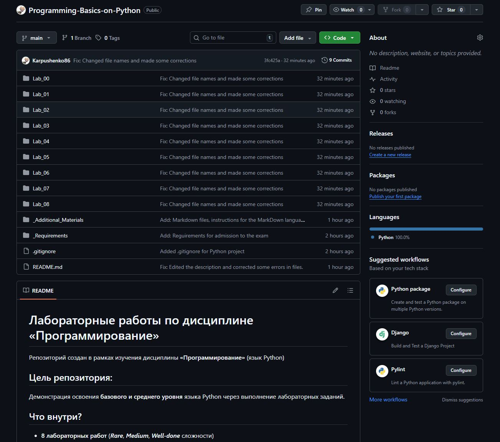
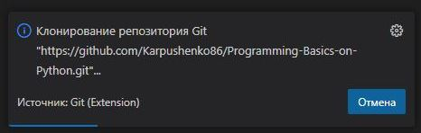
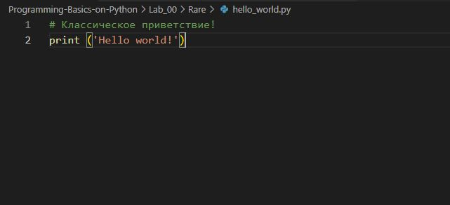
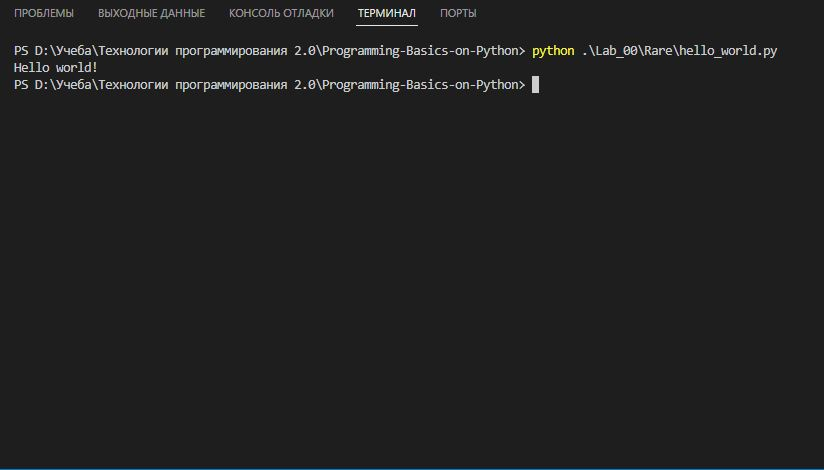
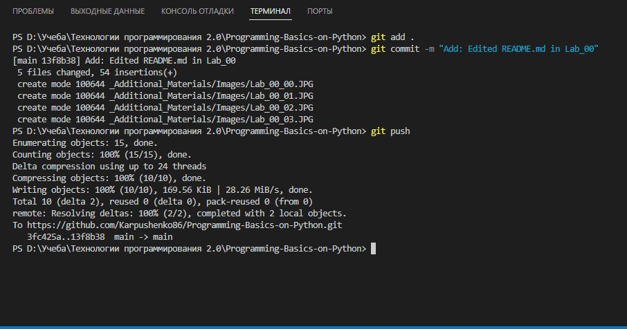

# Лабораторная работа №0 — Первое знакомство с Python

## Задание для самостоятельного выполнения
### Сложность: Rare
Создайте репозиторий для дисциплины на GitHub.
Склонируйте его себе на ПК.
Напишите свою первую программу.
Ззапустите её.
Сделайте коммит и пуш.
Напишите отчёт в README.md. Отчёт должен содержать:
Задание
Описание проделанной работы
Консольные команды
Скриншоты результатов
Ссылки на используемые материалы
Добавьте для себя в отчёт шпаргалку по работе с git.

## Описание проделанной работы
1. Создал репозиторий на GitHub: [https://github.com/Karpushenko86/Programming-Basics-on-Python](https://github.com/Karpushenko86/Programming-Basics-on-Python "Перейти по ссылке *ТЫК*")



2. Склонировал репозиторий на компьютер.



3. Написал файл `hello_world.py` с выводом "Hello, World!".



4. Запустил программу через терминал и сделал скриншот результата выполнения.



5. Закоммитил изменения и отправил на GitHub.



6. Оформил данный отчёт в [Lab_00/Rare/README.md](./README.md).

## Консольные команды

```bash
# Клонирование
git clone https://github.com/Karpushenko86/Programming-Basics-on-Python.git
cd Programming-Basics-on-Python

# Запуск программы
python hello_world.py

# Git-команды
git add hello_world.py
git commit -m ""
git push origin main