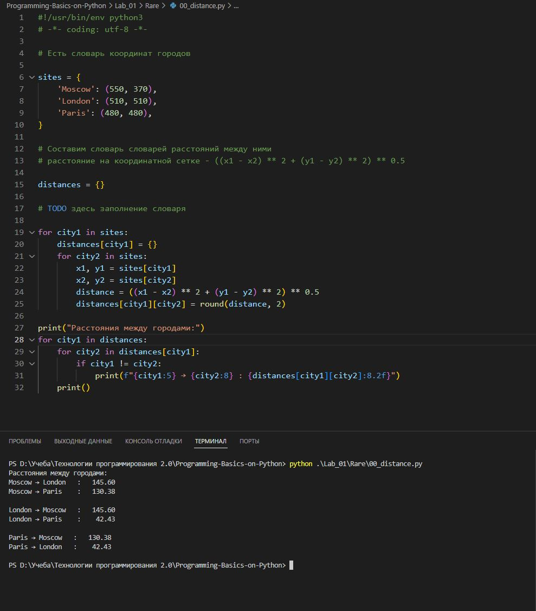
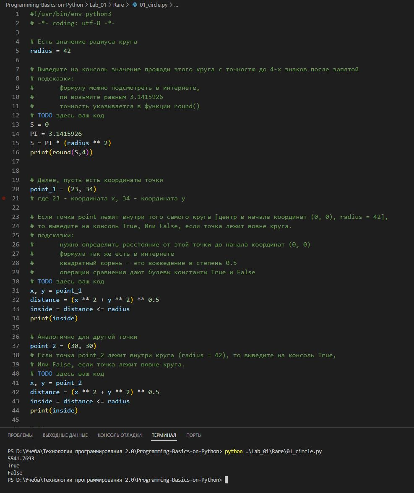
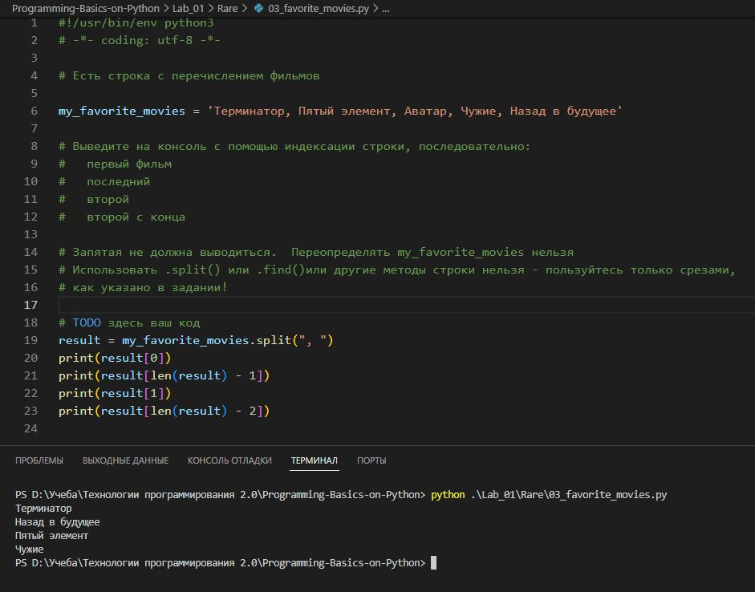
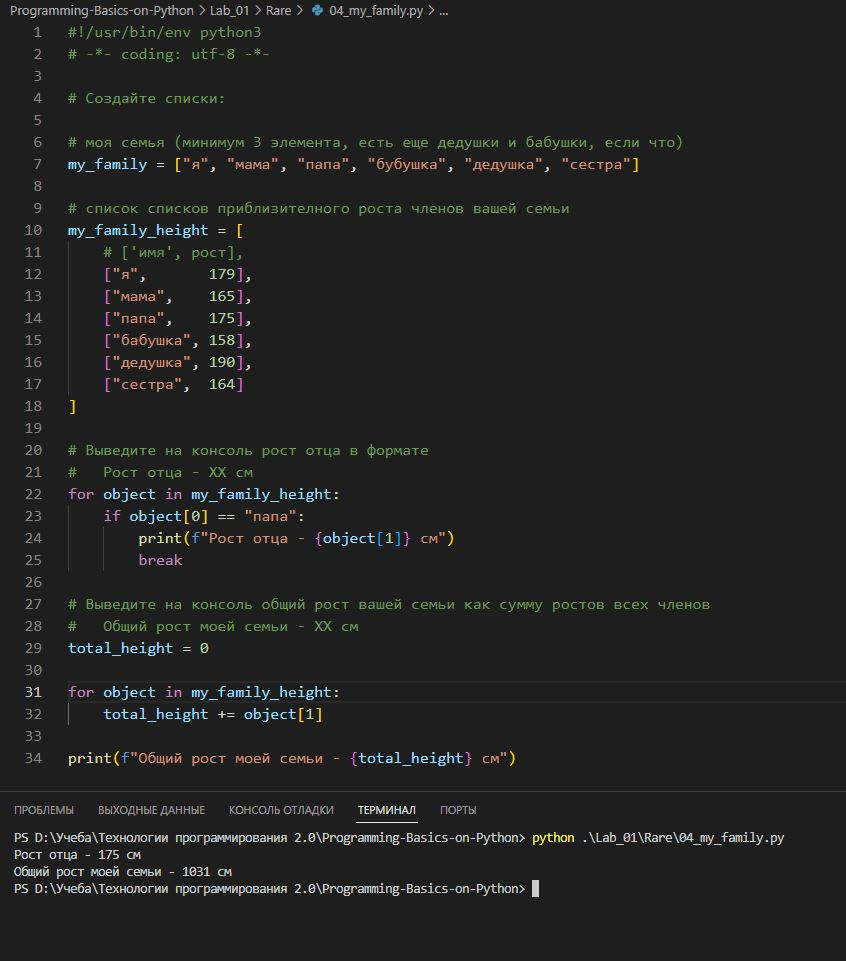
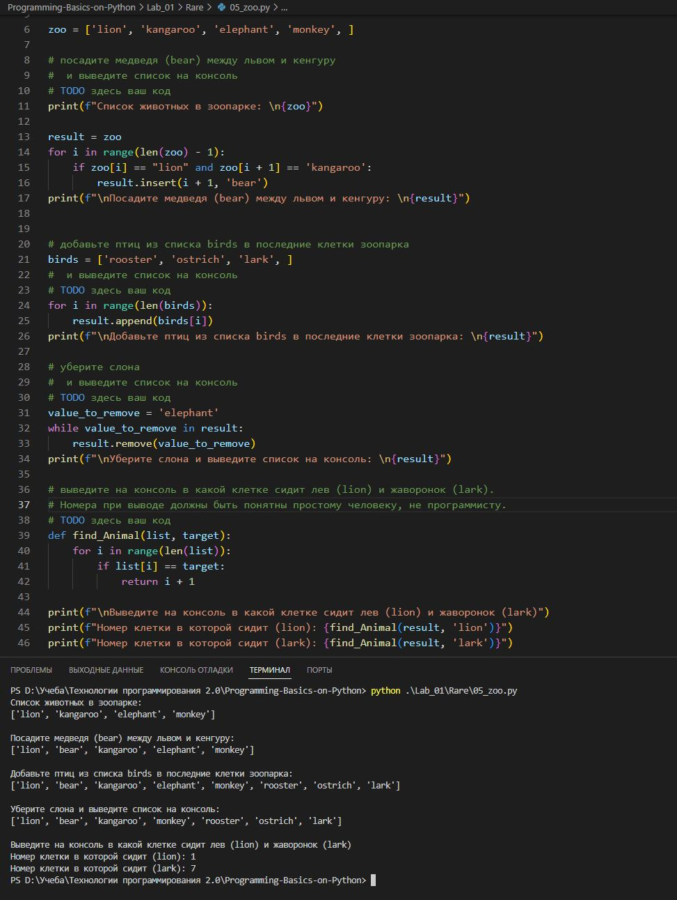
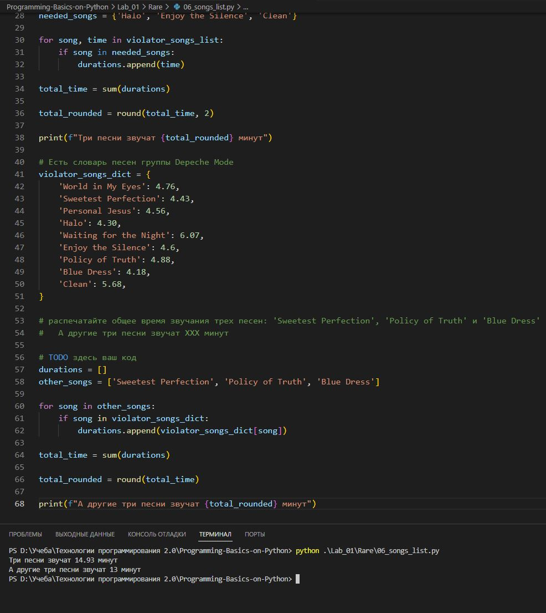
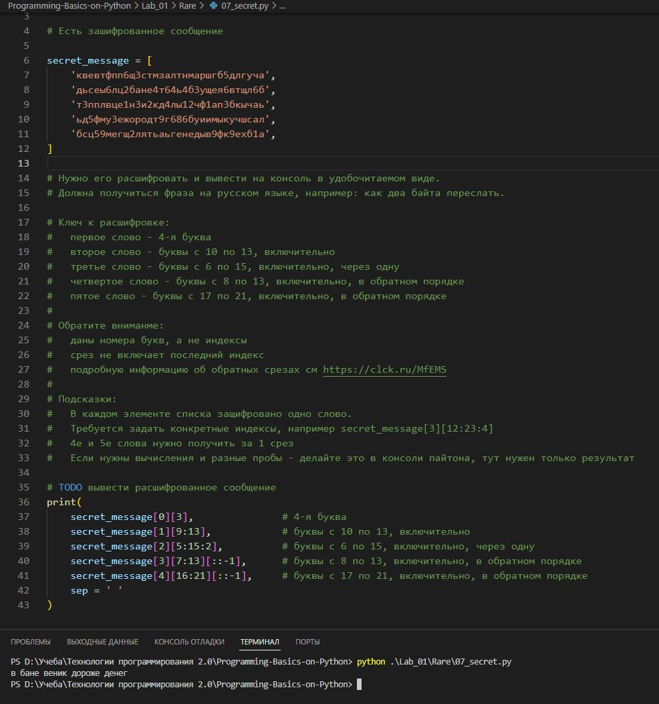
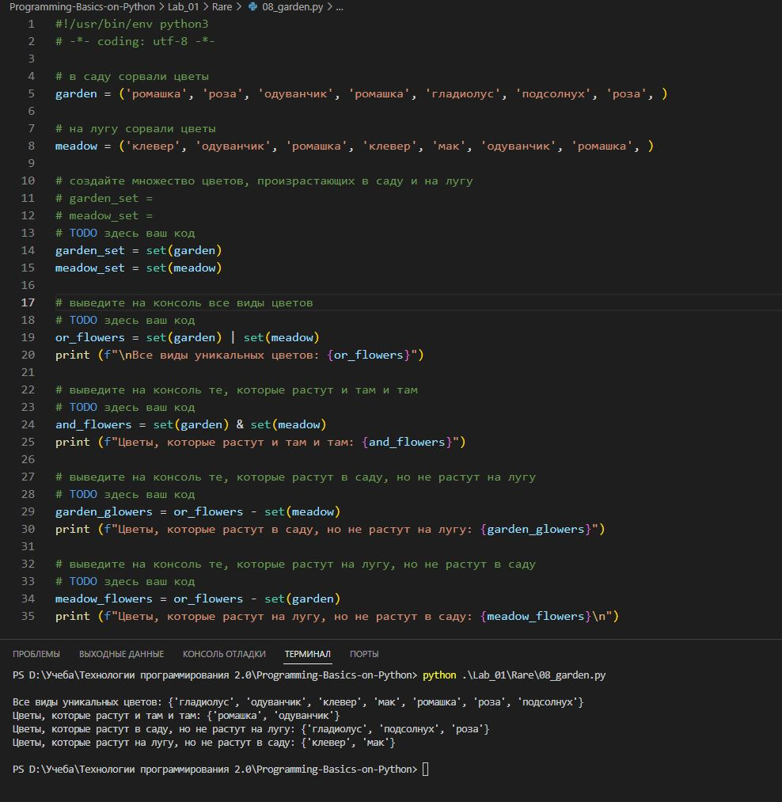
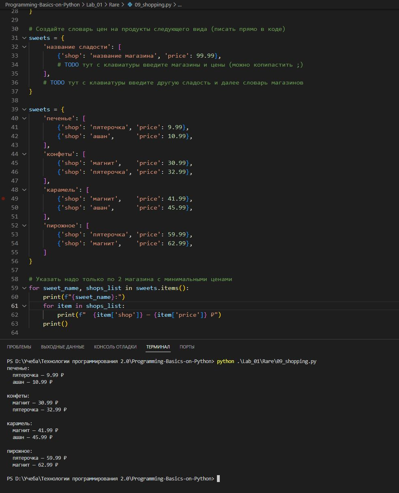
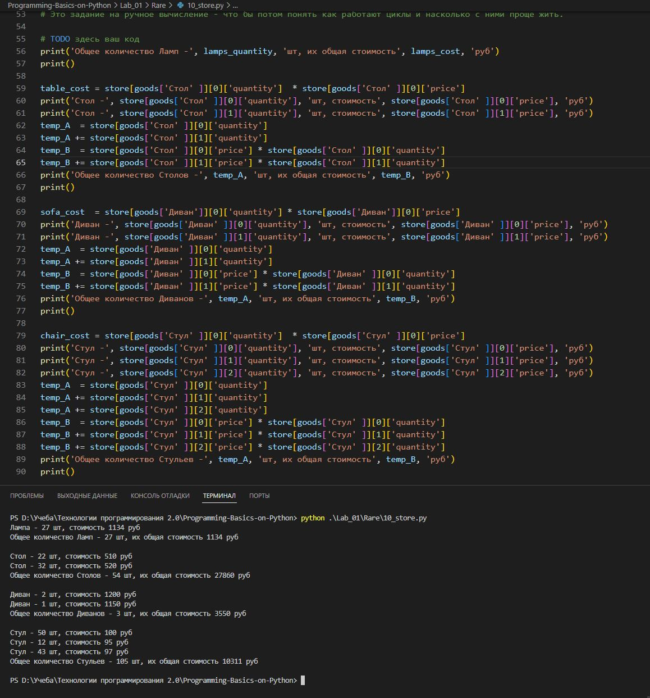

# Отчёт по Лабораторной работе №1 (Cложность: Rare)

## 00_distances  
**Задача:**  
Составить словарь расстояний между заданными городами по их координатам на плоскости.  
Расстояние считать по формуле Евклидова расстояния.

**Результат выполнения программы:**

 

## 01_circle  
**Задача:**  
1. Посчитать и вывести площадь круга радиусом 42 с точностью до 4 знаков.  
2. Определить, лежат ли две заданные точки внутри круга с центром в (0,0) и радиусом 42.

**Результат выполнения программы:**

 

## 02_operations  
**Задача:**  
Расставить знаки +, -, *, () между числами 1 2 3 4 5 (в этом порядке) так, чтобы получилось ровно 25.

**Результат выполнения программы:**

 

## 03_favorite_movies  
**Задача:**  
Используя только срезы строки, вывести:  
• первый фильм  
• последний фильм  
• второй фильм  
• второй с конца фильм  
(без запятых)

**Результат выполнения программы:**

 

## 04_my_family  
**Задача:**  
Создать список членов семьи и список списков [имя, рост].  
Вывести рост отца и суммарный рост всей семьи.

**Результат выполнения программы:**

 

## 05_zoo  
**Задача:**  
1. Добавить медведя между львом и кенгуру  
2. Добавить птиц в конец списка  
3. Убрать слона  
4. Вывести номера клеток со львом и жаворонком

**Результат выполнения программы:**

 

## 06_songs_list  
**Задача:**  
1. Посчитать общее время звучания трёх песен из списка  
2. Посчитать общее время звучания трёх других песен из словаря

**Результат выполнения программы:**

 

## 07_secret  
**Задача:**  
Расшифровать секретное сообщение, используя указанные правила срезов для каждого слова.

**Результат выполнения программы:**

 

## 08_garden  
**Задача:**  
1. Создать множества цветов из сада и луга  
2. Вывести:  
   • все виды цветов  
   • цветы, растущие и там, и там  
   • только в саду  
   • только на лугу

**Результат выполнения программы:**

 

## 09_shopping  
**Задача:**  
Составить словарь сладостей, где для каждой сладости указаны два магазина с самыми низкими ценами.

**Результат выполнения программы:**

 

## 10_store  
**Задача:**  
Без использования циклов посчитать и вывести для каждого товара:  
Количество штук на складе и их общую стоимость.

**Результат выполнения программы:**

