# Отчёт по Лабораторной работе №2 (Cложность: Rare)

## Задание

Разработать программу для визуализации **кусочно-заданной функции** и касательной к ней в заданной точке `x₀`.  
Для каждого варианта требуется:
- Определить функцию `f(x)` и её производную `f'(x)` на двух интервалах.
- Вычислить значение функции и производной в точке касания.
- Построить график с выделением ветвей разными цветами.
- Нарисовать касательную, отметить точку касания и добавить информативную аннотацию.
- Сохранить график в высоком разрешении.

Программа реализована с удобным консольным меню для выбора любого из 12 вариантов.

## Работа с графиками из книги

Практика построения простых графиков с использованием библиотеки **Matplotlib** (синус, парабола, экспонента и другие функции) была выполнена в отдельной директории:

→ [`Lab_02/_Matplotlib_test`](https://github.com/Karpushenko86/Programming-Basics-on-Python/tree/main/Lab_02/_Matplotlib_test)

Внутри папки находятся:
- `PyPlot` — базовые примеры работы с `matplotlib.pyplot`;
- `Matplotlib_Lessons` — примеры из уроков книги.

## Общее описание решения для Вариантов

Для удобства и чистоты кода решение разделено на модули:
- `common.py` — универсальная функция построения графика с **автоматическим обнаружением разрывов**.
- `variants/variant_XX.py` — математическое описание функции и производной для каждого варианта.
- `main.py` — консольное меню для запуска любого варианта.

**Ключевые особенности реализации:**
- Использование `np.piecewise` и `np.where` для кусочной функции.
- Автоматическое разбиение на непрерывные сегменты (разрывы не соединяются линией).
- Адаптивная аннотация точки касания (всегда удобно расположена).
- Сохранение графиков в папку `graphs/` с высоким качеством (dpi=320).
- Полное соответствие PEP 8, PEP 20, PEP 257, PEP 484.

### Примеры графиков всех вариантов:

Ниже представлены графики для всех 12 вариантов (нажми на изображение для увеличения):

## Графики всех 12 вариантов

**Вариант 1**  
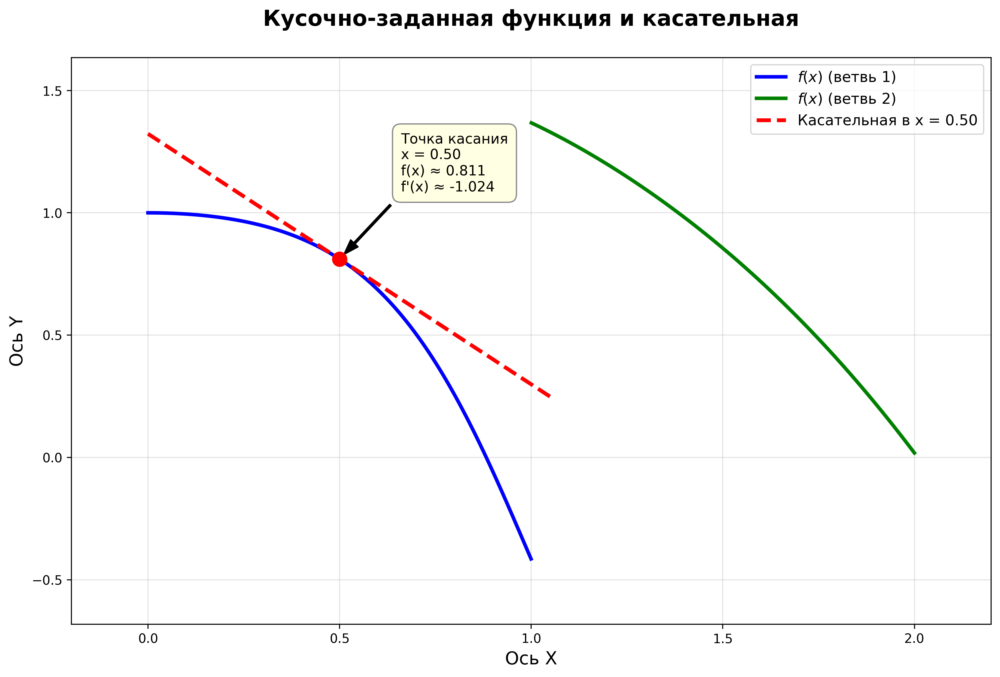

**Вариант 2**  
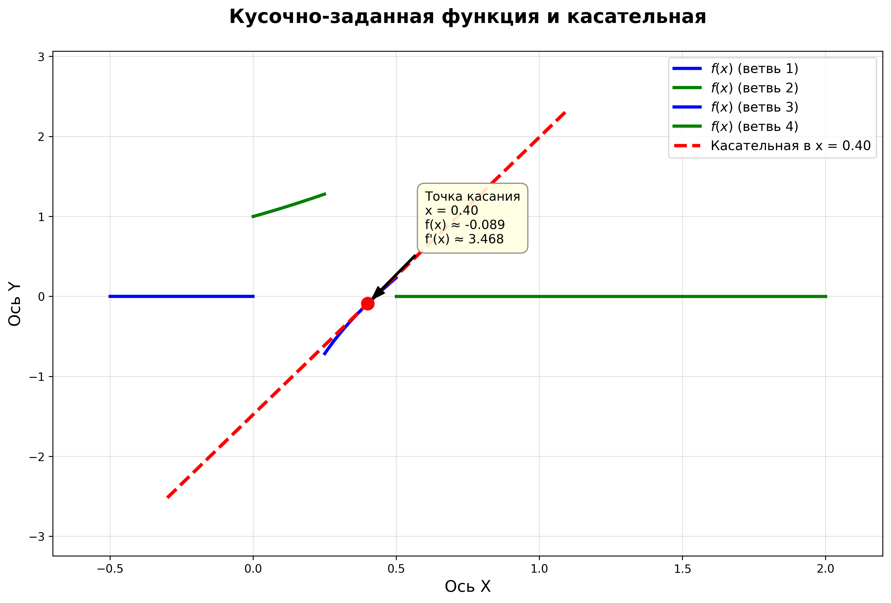

**Вариант 3**  
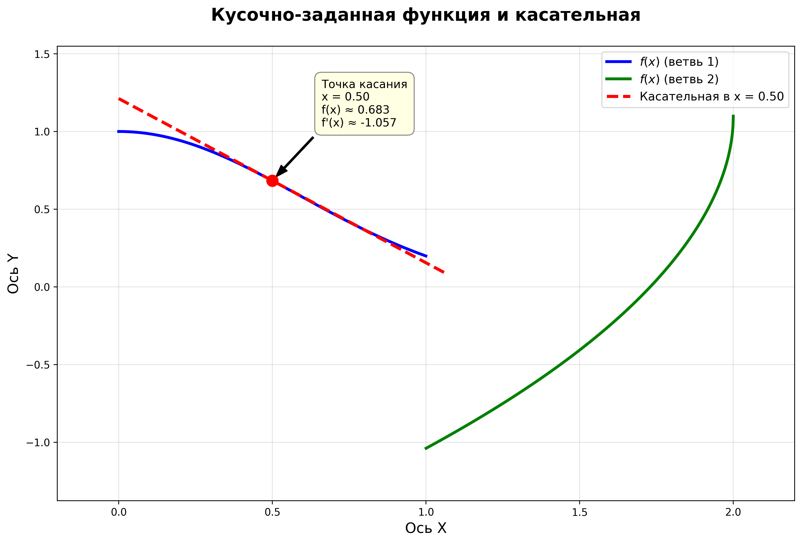

**Вариант 4**  
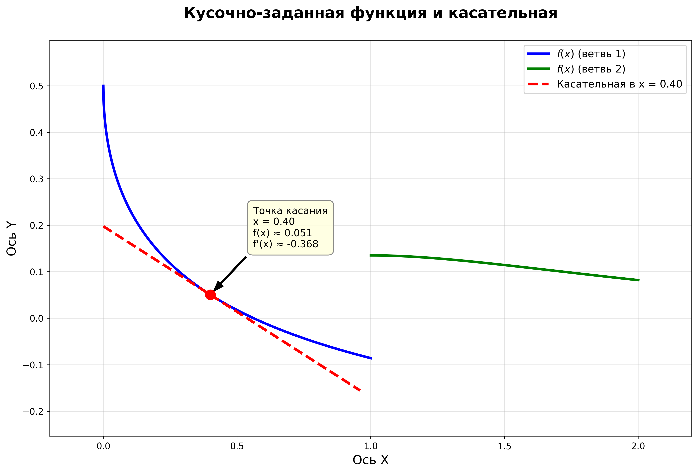

**Вариант 5**  
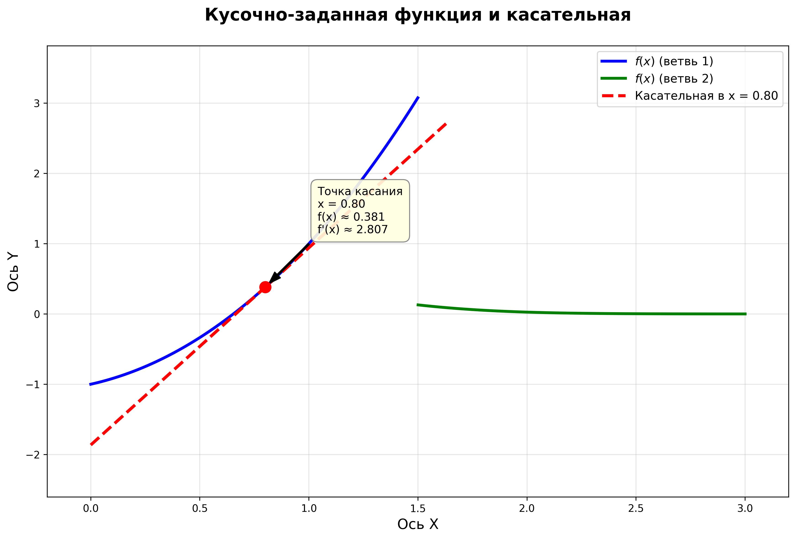

**Вариант 6**  
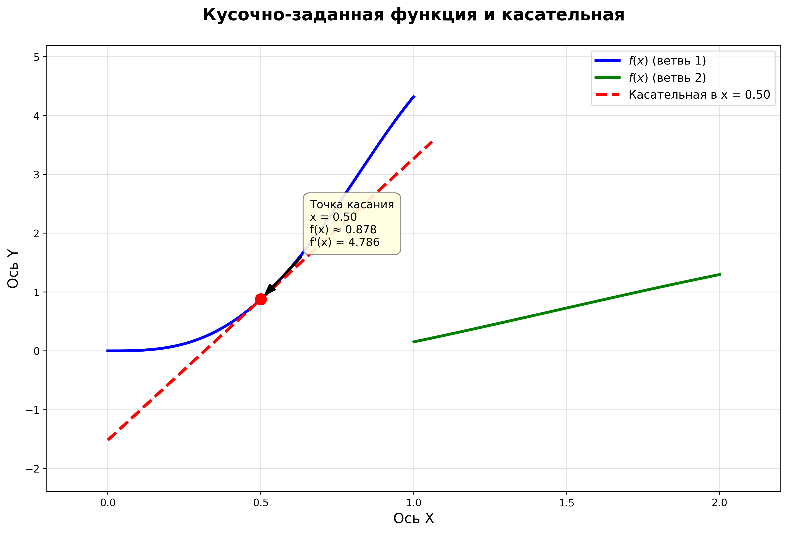

**Вариант 7**  
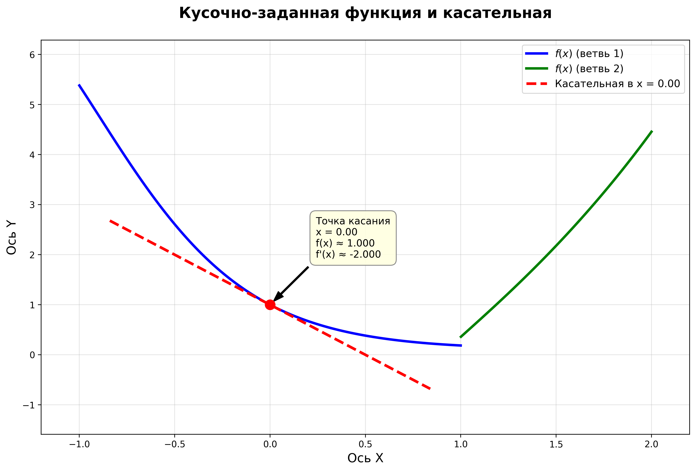

**Вариант 8**  
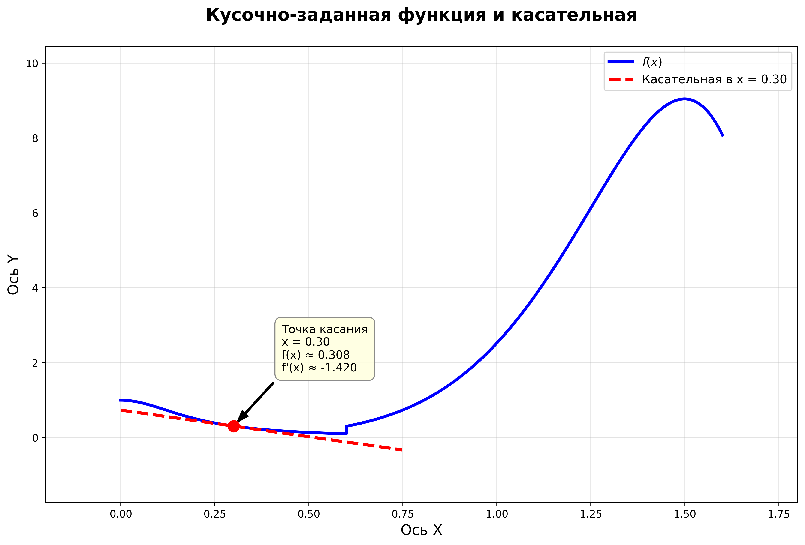

**Вариант 9**  
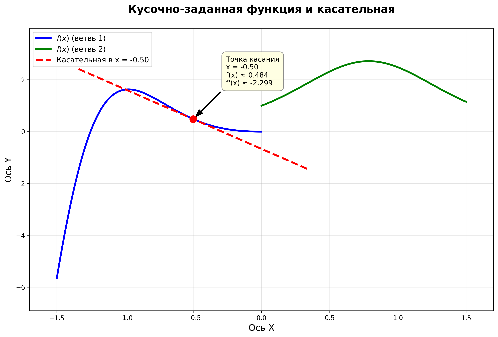

**Вариант 10**  
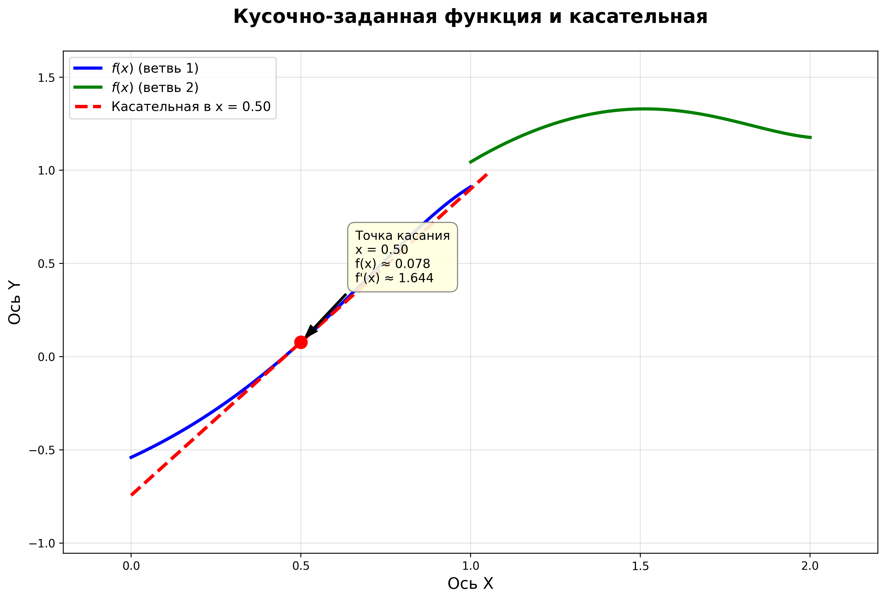

**Вариант 11**  
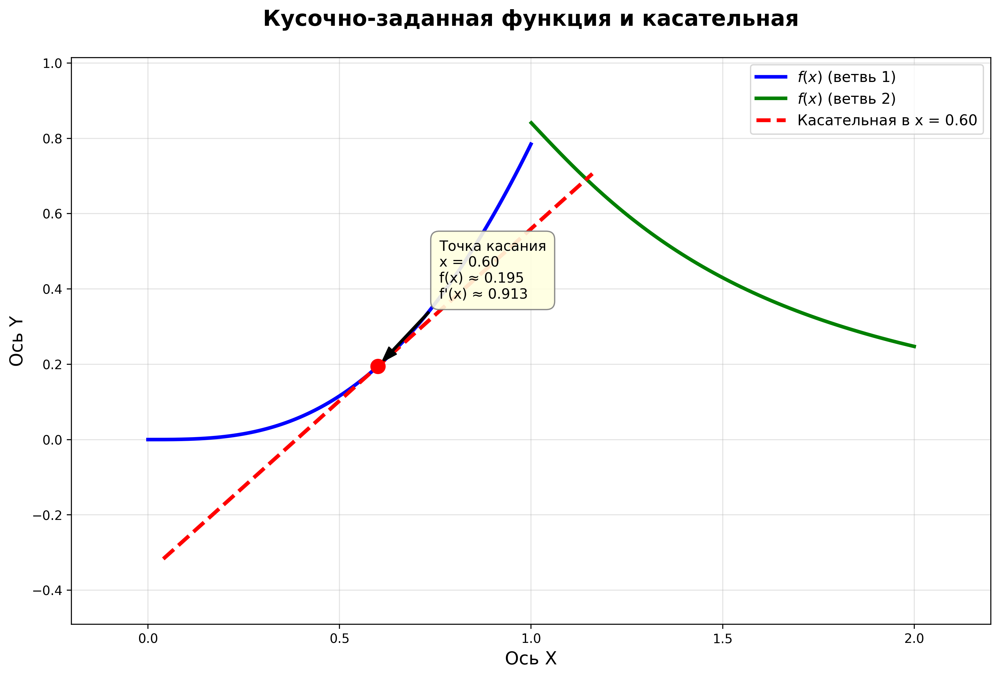

**Вариант 12**  
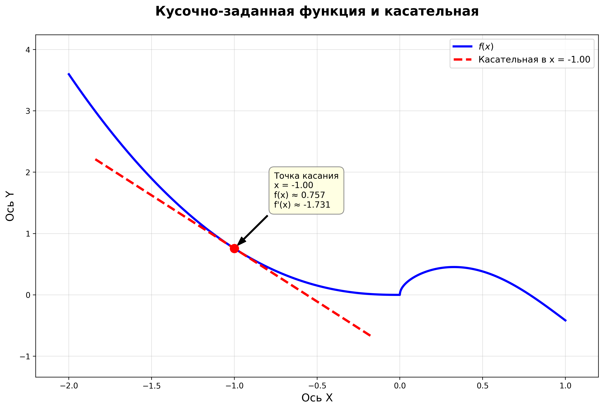

### Анализ результатов

Во всех вариантах программа корректно:
- Определяет разрывы (если они есть) и рисует ветви разными цветами без ложных соединений.
- Строит касательную точно в указанной точке `x₀`.
- Выводит информацию о точке касания в консоль и на графике.
- Адаптивно размещает аннотацию в зависимости от положения точки.

Графики демонстрируют поведение кусочно‑заданной функции на заданном интервале для разных Вариантов. Касательная линия наглядно показывает локальное поведение функции в окрестности точки, угловой коэффициент которой равен значению производной в этой точке. Визуализация позволяет оценить гладкость перехода и характер изменения функции на разных участках.

## Список использованных источников

1. [PEP 8 — Style Guide for Python Code ](https://peps.python.org/pep-0008/) 
2. [PEP 20 — The Zen of Python ](https://peps.python.org/pep-0020/) 
3. [PEP 257 — Docstring Conventions  ](https://peps.python.org/pep-0257/)
4. [PEP 484 — Type Hints](https://peps.python.org/pep-0484/)
5. [Matplotlib: Pyplot tutorial](https://matplotlib.org/stable/tutorials/pyplot.html)
6. [GeeksforGeeks — Matplotlib Tutorial](https://www.geeksforgeeks.org/matplotlib-tutorial/)
7. [NumPy Documentation — Mathematical functions](https://numpy.org/doc/stable/reference/routines.math.html)
8. [Python in Scientific Computing — Plotting with Matplotlib](https://scipy-lectures.org/intro/matplotlib/index.html)
9. [Real Python — Basic Data Visualization with Matplotlib](https://realpython.com/python-matplotlib-guide/)

